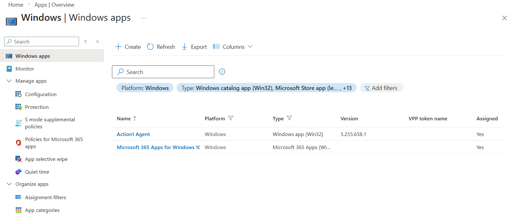
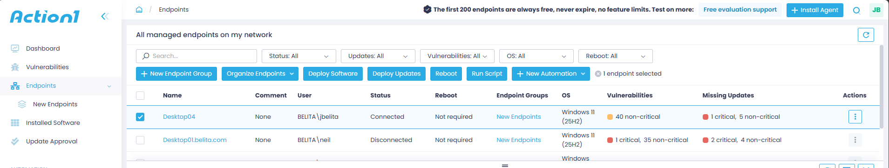
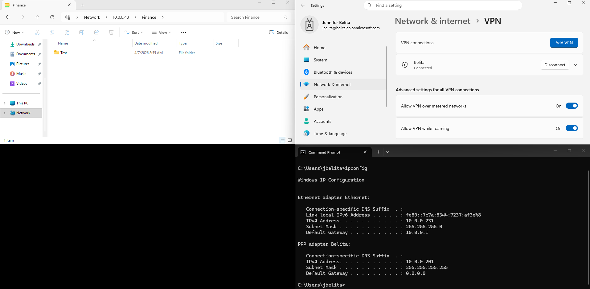
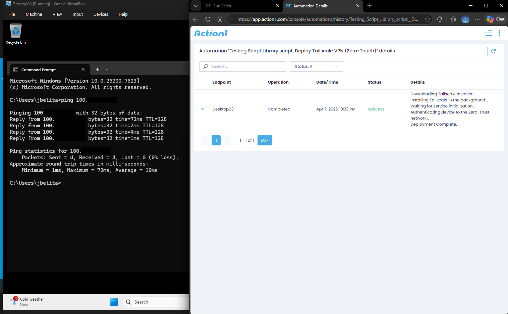

# 🏗️ Hybrid Enterprise Infrastructure & Architecture

**Architect:** John Belita

**Location:** Calgary, AB | **Email:** johnalbertbelita@gmail.com

**Certifications:** CompTIA Security+ (2026)

> 🚨 **NOTE:** This repository documents the architecture, deployment, and security hardening of a hybrid cloud enterprise IT environment.
> ➡️ **To see how I actively manage, support, and troubleshoot this environment using Jira Service Management, view my [Enterprise Incident Management Repository](https://github.com/chingilik/enterprise-incident-management).**

## 🧠 Executive Summary & Key Learnings

Building this hybrid environment bridged the gap between theoretical cybersecurity concepts and practical enterprise engineering. By building this architecture from scratch, I developed hands-on proficiency in:

* **Hybrid Identity Management:** Successfully synchronized on-premise Active Directory with Microsoft Entra ID via Entra Connect, mastering seamless Single Sign-On (SSO) and unified identity lifecycles across local and cloud environments.
* **Secure Remote Access & Zero-Trust Networking:** Architected secure remote access solutions ranging from legacy inbound VPN gateways (Windows Server RRAS) to modern, cryptographically secure **Zero-Trust Overlay Networks (Tailscale/WireGuard)**. Successfully eliminated edge firewall port-forwarding risks and hid internal infrastructure from public internet scanning.
* **Zero-Touch Provisioning & Endpoint Management:** Mastered endpoint lifecycle management through bare-metal imaging (WDS/PXE boot), cloud-based MDM (Microsoft Intune), and **Zero-Touch RMM automation (Action1)**. Successfully engineered and deployed silent PowerShell payloads and pre-authorized authentication keys over-the-air.
* **Security & Infrastructure Hardening:** Gained practical experience enforcing Zero Trust principles through Group Policy Objects (GPO), granular Role-Based Access Control (NTFS permissions), and time-based access restrictions.
* **PowerShell Automation:** Replaced manual, error-prone administrative tasks with PowerShell scripting, significantly reducing provisioning times by automating bulk HR data ingestion, account creation, and silent background software deployments.
* **Platform-Agnostic SaaS Administration:** Broadened cloud administration skills by configuring and securing both Microsoft 365 and Google Workspace tenants, mastering email routing, aliases, and collaborative access boundaries.
* **Foundation for Security Operations (SecOps):** Engineered this entire infrastructure with visibility in mind, designing it to act as the primary target environment for my active Blue Team threat-hunting and SIEM/EDR monitoring operations.

---

## 🚀 Project Overview

This repository serves as documented proof of my hands-on proficiency in Systems Administration and Infrastructure Engineering. I engineered this comprehensive environment from the ground up to bridge the gap between formal Cybersecurity education and modern enterprise architecture.

### 🌐 Network Architecture & IP Schema

To ensure reliable communication and strict isolation, the environment was built on a dedicated `/16` NAT Network topology.

* **Network Segment:** `10.0.0.0/16` (Subnet Mask: `255.255.0.0`)
* **Default Gateway / Edge:** `10.0.0.1`
* **Primary Domain Controller (YYC-DC-01):** `10.0.0.10` (Static)
* **DHCP Scope (Client Endpoints):** `10.0.0.100` – `10.0.0.200`
* **Internal Active Directory Forest:** `belita.com`
* **Microsoft 365 / Entra Tenant:** `belitalab.onmicrosoft.com`
* **Google Workspace Tenant:** `belita.online`

### 🛠️ Tech Stack & Tools

* **Infrastructure:** Windows Server 2022, Windows 11 Pro, Oracle VirtualBox
* **Identity & Cloud:** Active Directory (AD DS), Microsoft 365, Google Workspace, Microsoft Entra ID
* **Endpoint Provisioning:** Microsoft Intune (MDM), WDS (PXE Boot)
* **Network & Security:** DHCP, DNS, MX/SPF/DMARC, Group Policy (GPO), NTFS/RBAC
* **Automation:** PowerShell (Bulk Provisioning), Action1 (RMM)
* **Data Governance:** SharePoint Online, OneDrive, Intune Settings Catalog

## 🏗️ 1. Infrastructure Implementation & Networking

*Building the foundational server environment and establishing the domain.*

* **VM Configuration:** Provisioned Windows Server 2022 with optimized resource allocation to host core infrastructure roles.
* **Network Setup:** Configured a Static IP (`10.0.0.10`) for reliable DNS resolution and standardized the hostname (`YYC-DC-01`) to align with enterprise location-based naming conventions.

> **Figure 1.1: Static IPv4 Assignment** - Securing the Domain Controller's network identity with explicit DNS loopback pointers to establish the forest root.

> **Figure 1.2: Hostname Standardization** - Renaming the server to YYC-DC-01, establishing a scalable, location-aware naming convention.

* **Domain Controller:** Promoted the server to a DC, establishing the forest root `belita.com`.

> **Figure 1.3: AD DS Promotion** - Successfully promoting the Windows Server to a Domain Controller for the internal belita.com domain.

* **Client Join:** Deployed Windows 11 Pro endpoints, aligned local DNS to the DC (`10.0.0.10`), and successfully authenticated to the local domain.

> **Figure 1.4: Domain Authentication** - Verifying end-to-end connectivity and successful domain authentication from the Windows 11 client endpoint.

## 📂 2. Identity & Access Management (IAM)

*Designing the organizational structure and identity lifecycles.*

* **OU Architecture:** Designed a hierarchical Organizational Unit (OU) structure to logically separate Admins, Users, and Service Accounts.

> **Figure 2.1: Organizational Unit Architecture** - Designing a scalable OU hierarchy separating Service Accounts, Standard Users, and Administrative Tiers for granular policy application.

* **Access Restrictions:** Enforced strict Account Expiry and Logon Hour restrictions to mitigate unauthorized access outside business hours.

  

> **Figure 2.2: Time-Based Access Control** - Enforcing strict logon hour restrictions within ADUC (Top) and validating the policy enforcement at the client endpoint (Bottom) to mitigate after-hours insider threats.

* **PowerShell Automation:** Engineered a PowerShell script utilizing `Import-Csv` and `New-ADUser` to ingest HR spreadsheets and dynamically provision Active Directory accounts en masse.

> **Figure 2.3: PowerShell Bulk Provisioning** - Executing an automated ingestion script to parse HR CSV data, dynamically generate SamAccountNames, and enforce mandatory initial password resets (Zero Trust).

## 🗄️ 3. File Server, RBAC, and Security Hardening

*Implementing Role-Based Access Control and automating security protocols.*

* **File Share Hierarchy:** Designed a structured file share hierarchy and managed access strictly via Security Groups rather than individual users to ensure scalable management.

  

> **Figure 3.1: RBAC & NTFS Permissions** - Implementing Role-Based Access Control (RBAC) by mapping explicit NTFS folder permissions directly to Active Directory Security Groups.

* **Access Validation:** Confirmed "Access Denied" triggers for unauthorized users to verify NTFS permission inheritance and least-privilege access.

> **Figure 3.2: Least Privilege Validation** - Confirming successful inheritance blocking with a hard 'Access Denied' trigger for an unauthorized user account.

* **GPO Hardening:** Deployed domain-wide Group Policy Objects (GPOs) to enforce a strict 12-character minimum password policy, 90-day rotations, and a 3-attempt Account Lockout threshold.

  

> **Figure 3.3: Security Policy Hardening (GPO)** - Deploying domain-wide Group Policy Objects to enforce enterprise-grade password complexity and strict brute-force lockout thresholds.

## 💿 4. Automated OS Deployment (WDS)

*Architecting a PXE Boot environment for bare-metal OS provisioning.*

* **Image Management:** Extracted and published `boot.wim` and `install.wim` images to the Windows Deployment Services (WDS) Server.

> **Figure 4.1: WDS Image Management** - Extracting and mounting Windows PE boot environments and OS payloads to the Windows Deployment Services console.

* **Advanced Troubleshooting:** Resolved UDP Port 67 conflicts with the co-hosted DHCP server and optimized the TFTP Maximum Block Size to fix packet fragmentation (Error 1460).

  

> **Figure 4.2: Network Protocol Optimization** - Resolving UDP Port 67 listening conflicts between DHCP/WDS (Top) and adjusting TFTP Maximum Block Sizes to eliminate virtual packet fragmentation (Bottom).

* **PXE Execution:** Successfully deployed a Windows 10 image to a bare-metal client via PXE network boot.

  

> **Figure 4.3: Zero-Touch PXE Boot Execution** - A bare-metal client successfully requesting a DHCP IP, fetching the WDS boot image over the network, and initiating the automated Windows setup environment.

## ☁️ 5. Hybrid Cloud Identity (Entra Connect)

*Bridging on-premise Active Directory with the Microsoft 365 Cloud.*

* **Entra Connect Sync:** Configured alternative UPN suffixes (`belitalab.onmicrosoft.com`) and deployed Microsoft Entra Connect Sync, establishing a secure bridge between local AD and Entra ID.

> **Figure 5.1: UPN Suffix Routing** - Appending the external cloud domain as a valid Alternate UPN Suffix within local Active Directory Domains and Trusts to prepare for identity syncing.

* **Verification:** Verified the successful replication of local user identities and password hashes into the Microsoft 365 Admin Center.

> **Figure 5.2: Entra Connect Synchronization** - Verifying the successful automated replication of local AD identities into the Microsoft 365 Admin Center for seamless Single Sign-On (SSO).

## ☁️ 6. Cloud SaaS Administration (Google Workspace)

*Demonstrating platform-agnostic administration and strict email security.*

* **Tenant & Security:** Provisioned a Google Workspace tenant and managed organizational email routing by configuring secondary Email Aliases.

> **Figure 6.1: GWS Tenant & Email Aliases** - Managing organizational identities and configuring secondary email aliases to route department-level communications without supplemental licensing.

* **Access Control:** Engineered Google Groups to act as centralized security boundaries for RBAC and enforced restricted sharing permissions.

> **Figure 6.2: Collaborative Access Control** - Engineering Google Groups to act as centralized security boundaries for RBAC across enterprise Shared Drives.

## 📱 7. Modern Endpoint Management (Intune & RMM)

*Implementing Zero-Touch deployment and MDM policy enforcement.*

* **MDM Enrollment:** Orchestrated the enrollment of Windows 11 endpoints into Microsoft Intune (Entra ID Joined) for over-the-air (OTA) management.

> **Figure 7.1: MDM Device Enrollment** - Orchestrating the transition from legacy AD joining to Microsoft Entra ID Join, bringing endpoints under comprehensive cloud management.

* **Configuration Profiles:** Engineered and deployed profiles to enforce enterprise security baselines.

> **Figure 7.2: Configuration Profile Enforcement** - Validating the successful deployment of Intune security baselines natively on the client Operating System.

* **SharePoint Auto-Mount:** Engineered an Intune Settings Catalog profile leveraging the OneDrive administrative template to silently auto-mount secure SharePoint document libraries directly to remote users' File Explorers.

> **Figure 7.3: Zero-Touch Data Governance** - Leveraging an Intune payload to silently auto-mount secure SharePoint cloud vaults natively within the remote user's File Explorer, eliminating the need for traditional VPNs.

### 7.4 Zero-Touch RMM Deployment (Win32 App Packaging)

*Bridging MDM and RMM for automated endpoint visibility.*

* **Zero-Touch Automation:** Packaged the Action1 agent using the Microsoft Win32 Content Prep Tool (`.intunewin`). Engineered a silent deployment policy within Intune to push the RMM agent over-the-air to all cloud-joined workstations.

> **Figure 7.4: Intune App Deployment Configuration** - Configured the Action1 Agent as a required Win32 App in Microsoft Intune, setting silent installation arguments (`/qn`) and ensuring the app pushes automatically to domain-joined devices.

> **Figure 7.5: Action1 RMM Endpoint Discovery** - Successfully verified that the endpoint automatically received the Intune payload, installed the agent in the background, and reported back to the Action1 RMM dashboard as a fully managed device.

## 🌐 8. Legacy Remote Access (RRAS VPN Gateway)

*Deploying a secure VPN gateway to allow remote endpoints to tunnel into the corporate network and authenticate against Active Directory.*

* **VPN Gateway Configuration:** Deployed the **Routing and Remote Access Service (RRAS)** role on Windows Server 2022. Configured the server to act as a VPN gateway, managing a dedicated IPv4 address pool to lease internal IP addresses to remote off-site workers.
* **Active Directory Dial-in Authentication:** Configured Active Directory Dial-in permissions, ensuring that only explicitly authorized users possess the network access rights required to establish a remote tunnel.
* **Secure Remote File Access:** Successfully provisioned a remote Windows 11 endpoint with the built-in Windows VPN client. Verified that the endpoint could successfully authenticate, receive an internal PPP adapter IP address, and securely access locked-down local AD SMB file shares.

> **🔒 Security Architecture Note (Port Forwarding & Perimeter Defense):**
> *To simulate the public internet for this lab, I utilized a bridged network adapter (NAT). I intentionally **did not** configure Port Forwarding on my physical home ISP router to expose this VPN Gateway to the actual public internet. Opening raw server ports or utilizing legacy PPTP over the public web is a major security risk vulnerable to brute-force attacks. In a production enterprise environment, this perimeter access would be strictly handled by a dedicated edge firewall (e.g., pfSense, Fortinet) utilizing modern, cryptographically secure VPN protocols (WireGuard/OpenVPN).*

> **Figure 8.1: RRAS VPN Connection** - A remote Windows 11 endpoint successfully establishing a secure tunnel, obtaining a leased IP from the VPN pool, and accessing internal AD file shares.

## 🚀 9. Modern Zero-Trust Overlay Network (Tailscale)

*Migrating from legacy inbound VPN architectures to an outbound, cryptographically secure overlay network utilizing WireGuard.*

* **Infrastructure Gateway:** Deployed the Tailscale agent natively on the Windows Server 2022 Domain Controller, binding it to the `100.x.x.x` overlay network to act as a secure internal gateway without opening inbound edge firewall ports.
* **Zero-Touch RMM Deployment:** Engineered a PowerShell payload utilizing Tailscale's pre-authorized Auth Keys. Using the **Action1 RMM**, I successfully pushed this payload silently over-the-air to the remote Windows 11 endpoint. 
* **Execution & Verification:** The script downloaded the installer, executed it in the background (`/quiet`), and injected the Auth Key, immediately binding the endpoint to the secure network. The remote endpoint successfully resolved and pinged the internal Domain Controller over the Zero-Trust tunnel without any end-user interaction.

> **Figure 9.1: Zero-Touch VPN Automation** - Demonstrating the successful over-the-air deployment of the Tailscale agent via Action1 (Left) and the resulting silent authentication and internal network routing on the client endpoint (Right).

---

## 🛡️ Enterprise Security Operations & Threat Hunting

*This infrastructure serves as the foundational environment for my continuous learning in cybersecurity. To see how I actively monitor, defend, and threat-hunt within this exact environment, please visit my dedicated Security Operations repository.*

### ⚡ [View the Enterprise Security Operations (Wazuh SIEM & EDR) Repository](https://github.com/chingilik/enterprise-security-operations)
> I have expanded this architecture into a fully monitored, active security environment documented in a separate repository. 
>
> **The Mission:** Deployed a dedicated Ubuntu Linux host acting as a centralized **Wazuh SIEM** server. By pushing Wazuh EDR agents to the Windows Server infrastructure, I centralized security event logs, configured File Integrity Monitoring (FIM), and actively hunted for simulated brute-force authentication attacks against Active Directory. This marks the transition from purely building infrastructure to actively defending it.
